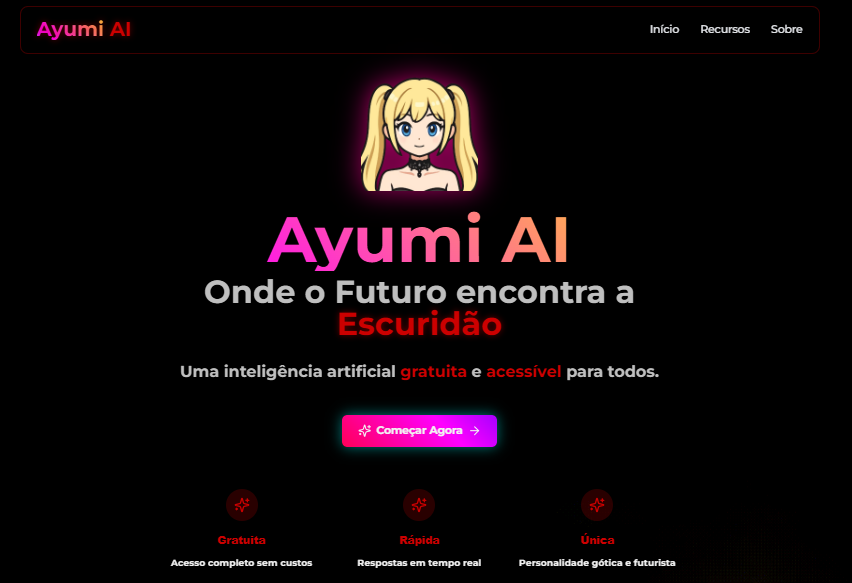

  

# 🤖 Ayumi AI
Ayumi AI is an interactive artificial intelligence project, developed with a focus on offering a modern, intuitive, and visually technological experience.

## ✨ Features
- Elegant and responsive web interface  
- Elements with a futuristic style and glass transparency  
- Fluid interactions with AI  
- Structure designed for scalability  

## 🛠️ Technologies used
- **Frontend:** React + Vite  
- **Styling:** Tailwind CSS  
- **Backend:** Node.js  
- **Hosting:** Render  

## 🌐 Access the project
🔗 [Click here to access Ayumi AI](https://ayumiai.onrender.com/)
